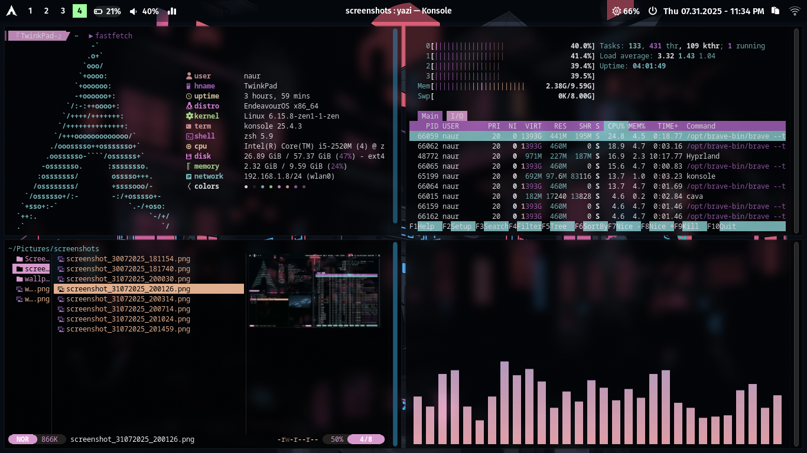

# hypr-backup
 Just backing up cuz im gonna mess with my disk partitions.
 
Hyprland on EndevourOS, backup files as of july 31, 2025. contains a janky, modified install script, configs for hypr, waybar, starship, fastfetch, konsole, and a wallpaper. Most apps and packages not included here cuz no way ill remember everything.
 
 

 Wait. the install script will still install stuff i dont need but yep.
 
 terminal: konsole
 terminal theme: mostly based on dark pastels
 package manager: pamac
 text editor: kate, vs code
 browser: brave
 file manager: thunar, yazi
 other stuff that auto installs: github-desktop
 other stuff missing here: gthumb, cava, printing apps and scanner, obs, swww + gswww, rahhh i cant do all this ill just go delete that partition.
