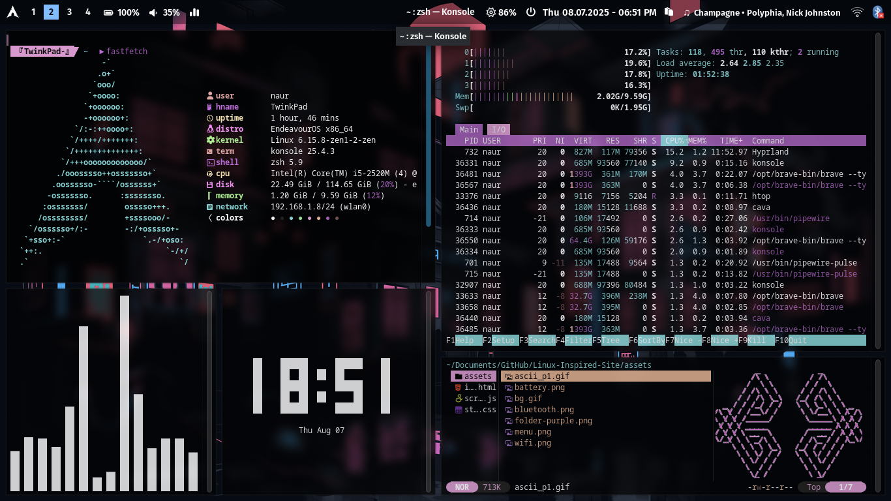

# hypr-backup

 

 terminal: konsole
 terminal theme: its in there
 package manager: pamac
 text editor: kate, code
 browser: firefox
 file manager: thunar
 
 other stuff missing here:
   apps: pamac, kate, vscode, github desktop, obs,  
   packages: swww and gswww (wallpaper manager, cuz waypaper and hyprpaper doesnt work for me), cmatrix-git, peaclock, cava, polkit-gnome (authentication agent something so pamac works), plymouth bgrt (archlinux loading screen on boot and power off), jakoolit simple-sddm (lockscreen theme, from github).
   
 stuff that i had to delete after (not sure where they came from but): uxterm/xterm, meld, brave, veracrypt.
 
 as of oct 24:
  -i switched to firefox instead of brave because theme-lain.
  -remember to go to hyprlock.conf to change sleep lockscreen.

ngl this is shit never use this script.
